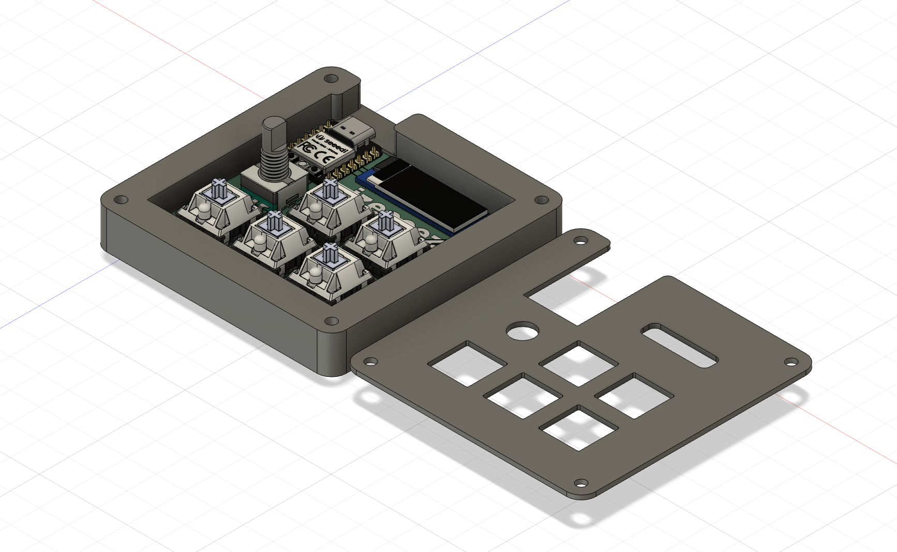
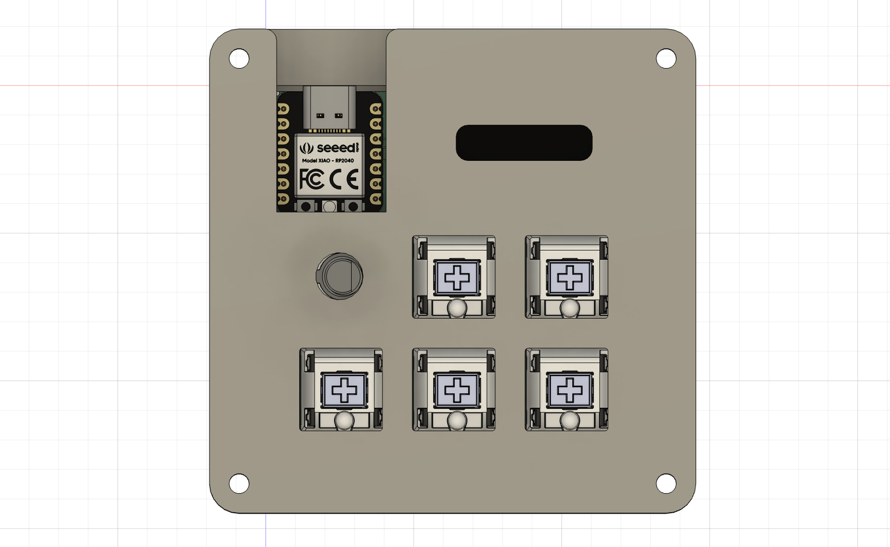
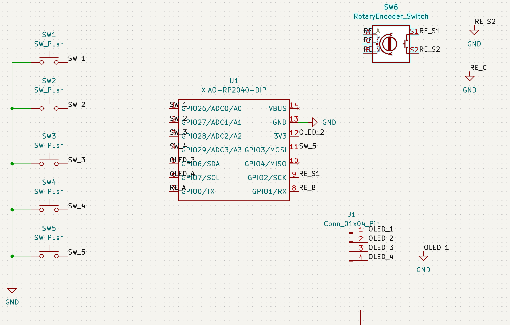
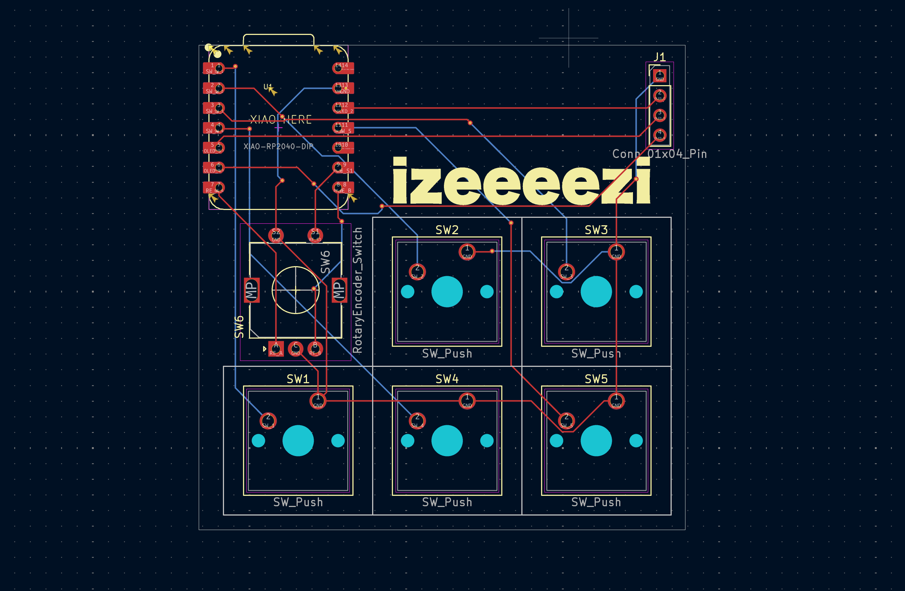
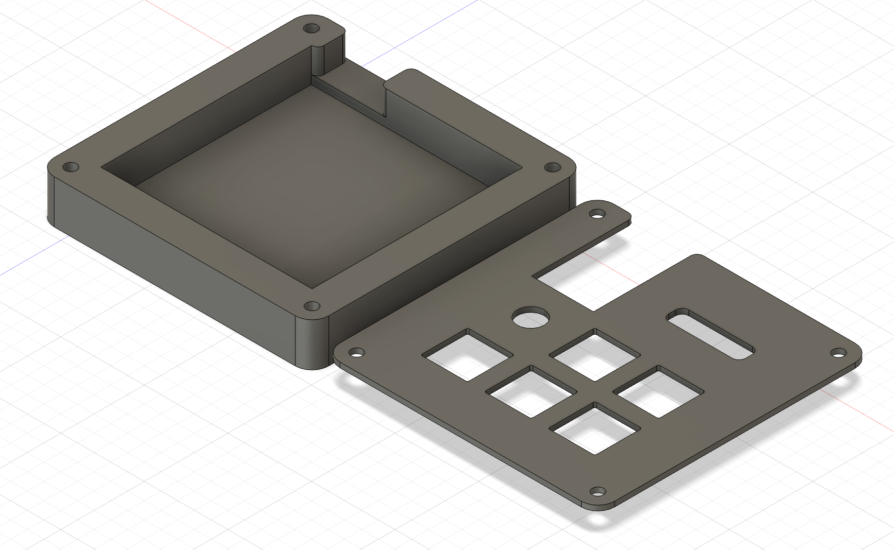

# IzeePad 

**IzeePad** is a custom 5-key macropad built as a fun exploration into the world of mechanical keyboards and custom electronics. I spend a lot of time at my desk, and I thought it would be a rewarding challenge to build a tool that makes my creative workflow just a little bit more personal.

---

## 💡 Inspiration & Ideation
The IzeePad started as a "just for fun" project. I wanted to see if I could design something from scratch, from the schematic to the physical 3D-printed case. 

Before this, I had never used **Fusion 360** or **KiCad**, and diving head-first into this build has completely leveled up my skills in 3D modeling and electronics design.

## 🛠 Features
* **5-Key Layout:** Mechanical switches configured as **Programmable Macros**, ready to be mapped to any creative shortcut I need.
* **EC11 Rotary Encoder:** A tactile dial for smooth volume control or timeline scrubbing.
* **0.91" OLED Display:** Visual feedback to show exactly what my pad is doing.
* **Xiao RP2040:** A tiny, powerful "brain" that makes the whole project possible.
* **Custom Build:** Assembled using 3D-printed parts and M3 heatset inserts for a sturdy, professional feel.

---

## 📸 Project Gallery

### Overall Hackpad

*The finished IzeePad: A fun project that adds a personal touch to my desk.*

### Schematic 

*The circuit logic designed in KiCad, showing the wiring for the buttons and OLED.*

### PCB Design

*The custom PCB layout, featuring the Seeed XIAO RP2040 mounted SMD-style.*

### Case & Assembly

*A look at the side profile and the 3D-printed assembly.*

---

## 💻 Firmware Overview
This pad runs on **KMK Firmware** using CircuitPython.
* **The Encoder:** Set to Volume Up/Down with a press-to-mute function.
* **The Keys:** Configured as a **Macro Layer**. Each key is a placeholder ready to be assigned to complex video editing shortcuts or VTuber scene triggers.
* **The Screen:** Provides real-time status updates on active layers.

---

## 📦 BOM (Bill of Materials)
* **1x** Seeed Studio XIAO RP2040
* **5x** MX-Style Mechanical Switches
* **5x** Blank DSA Keycaps (White)
* **1x** EC11 Rotary Encoder
* **1x** 0.91" 128x32 OLED Display (GND-VCC-SCL-SDA)
* **4x** M3x16mm Screws
* **4x** M3x5x4mm Heatset Inserts
